# Wearable + SDK – Healthcare IoT Concept

A compact, low-power wearable IoT platform for continuous monitoring of vital signs (HR, SpO₂, skin temperature, HRV, activity). Designed with early-warning logic and secure data integration, it connects seamlessly with healthcare and research systems. A companion SDK + reference API accelerates integration into clinical dashboards, remote patient monitoring (RPM), and wellness analytics workflows.

## Table of Contents

- [Project Goals](#project-goals)
- [Healthcare Challenges & Our Approach](#healthcare-challenges--our-approach)
- [Use Cases & Applications](#use-cases--applications)
- [Getting Started](#getting-started)
- [Hardware Components & Sensor Roles](#hardware-components-and-sensor-roles)
- [Module Dimensions](#module-dimensions)
- [Possible Device Dimensions](#possible-device-dimensions)
- [Data Collection & Processing](#data-collection--processing)
- [Optional Features](#optional-features)
- [System Architecture](#system-architecture)
- [Power & Energy Budget](#power--energy-budget)
- [System Integration](#system-integration)
- [Software Development Kit (SDK)](#software-development-kit-sdk)
- [API Reference (Draft)](#api-reference-draft)
- [Data Schema Examples](#data-schema-examples)
- [Security & Compliance](#security--compliance)
- [Testing & Validation](#testing--validation)
- [Development Roadmap](#development-roadmap)
- [Contributing](#contributing)
- [License](#license)
- [Summary](#summary)

## Project Goals

The primary goal is to build a functional prototype of the wearable health monitor, focusing on a complete hardware architecture that integrates sensors effectively. The design emphasizes cost-effectiveness for easy adaptation in commercial healthcare environments, ensuring it can fit various needs without high expenses.

Key objectives:
- Develop a generic, adaptable hardware setup that works across different healthcare scenarios.
- Prioritize sensor roles and data accuracy for reliable monitoring.
- After prototyping, design and fabricate a custom PCB with SMD modules for optimized production and scalability.

## Healthcare Challenges & Our Approach

### The Challenge
Traditional health monitoring often relies on bulky, expensive devices that are not suitable for continuous, everyday use. Many people lack access to affordable tools for tracking vital signs like heart rate, oxygen levels, and temperature at home or on the go. This leads to delayed detection of health issues, higher healthcare costs, and limited ability for doctors to monitor patients remotely.

### Our Approach
Our wearable health monitor is a small, lightweight device that continuously tracks key health metrics using simple sensors. It connects wirelessly to phones or the internet, sending data securely to healthcare providers or apps. The device is easy to wear, powered by a long-lasting battery, and comes with a software kit that makes it simple for developers and healthcare systems to integrate the data.

### Expected Outcomes
By providing affordable, continuous health monitoring, this device can help catch health problems early, reduce hospital visits, and improve patient care. It empowers individuals to take control of their health, supports remote patient monitoring for better outcomes, and lowers costs for healthcare systems. In the long term, it can contribute to better public health by enabling data-driven insights and preventive care.

## Use Cases & Applications

The wearable supports various healthcare scenarios by leveraging collected data for monitoring and alerts:

### Managing Chronic Conditions
- Tracks vital signs for long-term illnesses, enabling early interventions and reducing hospital visits.

### Home-Based Care
- Monitors recovery at home, providing real-time data for virtual check-ups and timely alerts.

### Senior Care
- Detects falls and vital sign changes in elderly settings, ensuring quick responses.

### Medical Research
- Collects objective data for clinical studies, helping evaluate treatments.

### Remote Healthcare
- Shares data with doctors during virtual visits for better diagnosis and care planning.

These applications demonstrate the device's versatility in preventive and specialized care scenarios. The accompanying SDK helps developers build connected health solutions that integrate seamlessly with existing healthcare infrastructure.

## Getting Started

Choose your path based on your role and interests:

### 🔧 **For Hardware Developers & Makers**

**Quick Start - Build Your First Prototype**
1. **Gather Components** (Est. cost: $45-60)
   - Seeed XIAO ESP32-C6 microcontroller ($7)
   - MAX30102 pulse oximeter sensor ($8)
   - MLX90632 temperature sensor ($15)
   - BMI270 motion sensor ($12)
   - 3.7V LiPo battery 200mAh ($8)
   - Basic prototyping materials ($10-15)

2. **Assembly Steps**
   - Follow our [Hardware Assembly Guide](docs/hardware-assembly.md)
   - Use breadboard for initial prototyping
   - Download reference PCB layouts from `/hardware` folder
   - Test each sensor individually before integration

3. **Firmware Setup**
   ```bash
   git clone https://github.com/rxops/wearable
   cd firmware
   # Follow platform-specific setup in README
   ```

### 💻 **For Software Developers**

**SDK Integration - Start Developing in Minutes**
1. **Install the SDK**
   ```bash
   npm install @rxops/wearable-sdk
   # or
   pip install wearable-health-sdk
   ```

2. **Quick API Example**
   ```javascript
   import { WearableClient } from '@rxops/wearable-sdk';
   
   const client = new WearableClient({
     apiKey: 'your-key',
     deviceId: 'device-123'
   });
   
   // Get latest vitals
   const vitals = await client.getLatestMetrics();
   console.log(`HR: ${vitals.heartRate}, SpO2: ${vitals.spo2}%`);
   ```

3. **Explore Features**
   - Real-time WebSocket streaming
   - Historical data queries
   - Custom alert configurations
   - FHIR-compliant data export

### 🏥 **For Healthcare Professionals**

**Evaluation & Pilot Programs**
1. **Request Demo Access**
   - [Schedule a demo](link) with our healthcare team
   - Receive temporary device and dashboard access
   - Review clinical validation data and accuracy reports

2. **Pilot Program Setup**
   - Small-scale deployment (5-10 devices)
   - Integration with your EHR system
   - Staff training and workflow integration
   - 30-day evaluation period with support

3. **Clinical Integration**
   - FHIR-compliant data mapping
   - Remote patient monitoring workflows
   - Alert customization for your protocols
   - Compliance documentation (HIPAA, FDA)

### 🔬 **For Researchers & Academics**

**Research Collaboration Opportunities**
1. **Academic Partnership**
   - Access to research-grade devices
   - Raw sensor data export capabilities
   - Custom data collection protocols
   - Co-publication opportunities

2. **Grant Collaboration**
   - NIH, NSF, and international funding support
   - Joint proposal development
   - Technical expertise and hardware provision
   - Data analysis and validation support

3. **Open Source Contributions**
   - Algorithm improvement projects
   - Signal processing enhancements
   - Multi-device studies and datasets
   - Clinical validation studies

### 📋 **Common Prerequisites**

**All Users:**
- Basic understanding of health monitoring concepts
- Access to development environment (varies by path)
- Familiarity with REST APIs (for software integration)

**Recommended Reading:**
- [Technical Architecture Overview](docs/architecture.md)
- [Security & Compliance Guide](docs/security.md)
- [API Reference Documentation](docs/api/)

**Discusssion:**
- 📧 General: info@rxops.org

## Hardware Components and Sensor Roles

The hardware architecture prioritizes **cost-effectiveness** and **adaptability**, using standard, affordable components that can be easily sourced and integrated. This ensures the prototype is functional and scalable for commercial healthcare use while keeping the device lightweight and comfortable for all-day wear.

### Core Microcontroller

**Seeed XIAO ESP32-C6** — Ultra-compact wireless-enabled microcontroller optimized for low-power IoT applications.

**Key Specifications:**
- **Dimensions:** 18mm × 25.5mm × 2.8mm
- **Wireless:** Wi-Fi 6 + Bluetooth 5.3 LE
- **Power Management:** Multiple sleep modes for extended battery life
- **Processing:** RISC-V 32-bit @ 160MHz with hardware crypto acceleration

**Communication Capabilities:**
- **Wi-Fi:** Periodic cloud synchronization and firmware updates
- **Bluetooth LE:** Real-time streaming to mobile apps and nearby devices
- **Low-Power Modes:** <10µA deep sleep for extended battery operation

    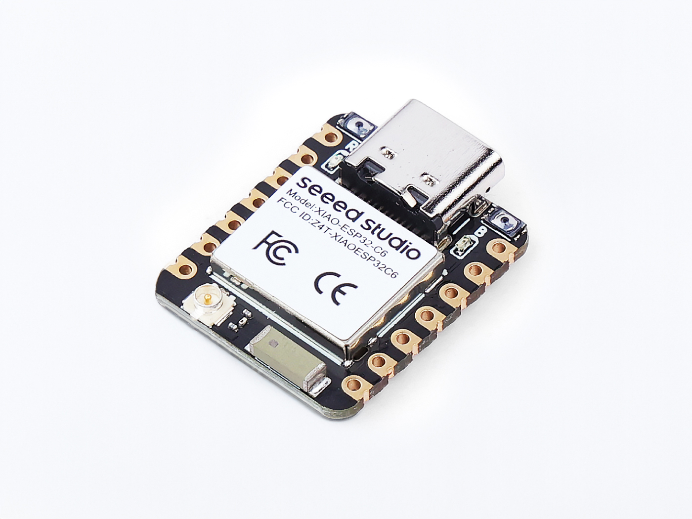
    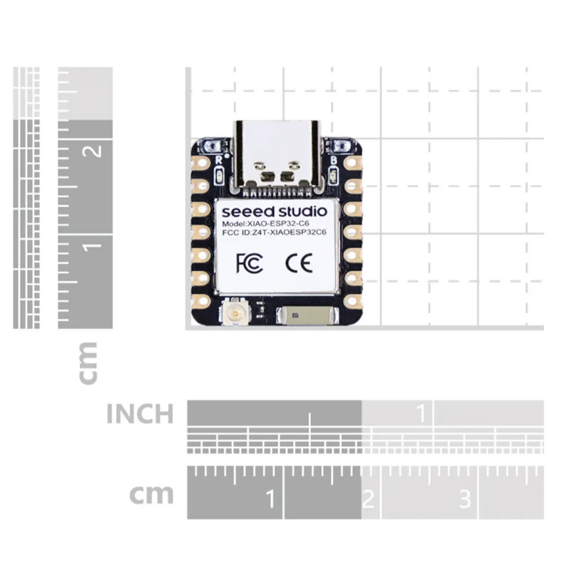
    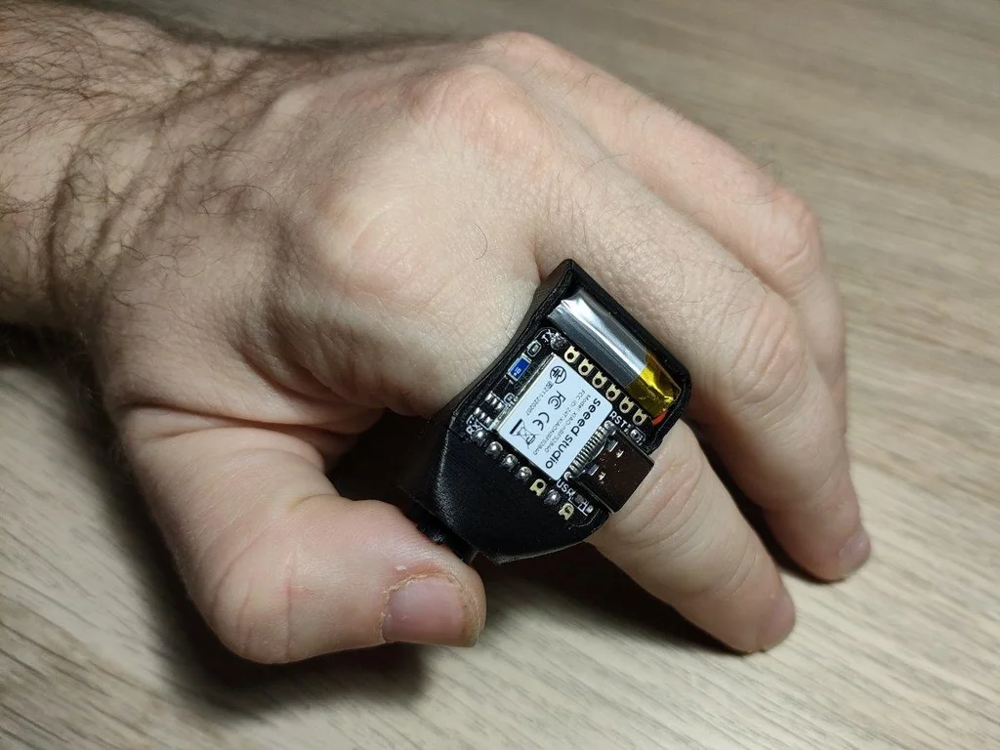

### Primary Sensors

#### Pulse Oximetry & Heart Rate Sensor
**Maxim MAX30102** — Integrated pulse oximetry and heart rate monitoring solution

**Technical Specifications:**
- **Dimensions:** 5.6mm × 3.3mm × 1.55mm
- **Interface:** I2C (400kHz standard)
- **LEDs:** Red (660nm) + Infrared (880nm) for SpO₂ measurement
- **Power Consumption:** 6–12mA during measurement (duty cycle optimized)

**Measured Parameters:**
- **Heart Rate:** Continuous BPM monitoring with HRV analysis
- **Blood Oxygen (SpO₂):** Non-invasive oxygen saturation measurement
- **Perfusion Index:** Blood flow quality indicator
- **Heart Rate Variability:** Time-domain analysis (RMSSD, SDNN)

    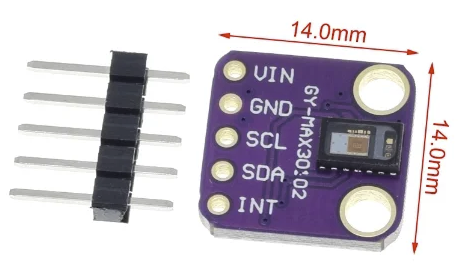
    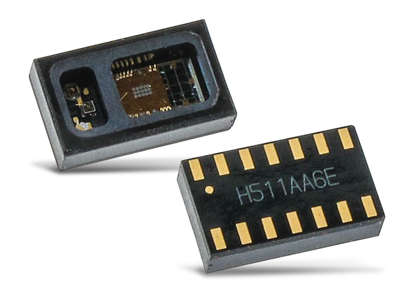

#### Non-Contact Temperature Sensor
**Melexis MLX90632** — Medical-grade infrared temperature sensor

**Technical Specifications:**
- **Dimensions:** 3mm × 3mm × 0.9mm (ultra-compact)
- **Interface:** I2C (up to 1MHz)
- **Accuracy:** ±0.2°C (medical grade)
- **Range:** -20°C to +85°C object temperature

**Measurement Capabilities:**
- **Skin Temperature:** Continuous non-contact monitoring
- **Core Temperature Estimation:** Algorithm-based body temperature inference
- **Fever Detection:** Real-time temperature anomaly alerts
- **Thermal Profiling:** Daily temperature pattern analysis

#### Motion & Activity Sensor
**Bosch BMI270** — Ultra-low power inertial measurement unit *(planned integration)*

**Technical Specifications:**
- **Interface:** SPI/I2C selectable
- **Power:** 0.8mA typical operation
- **Features:** Built-in activity recognition and gesture detection
- **Sampling:** 25–50Hz with intelligent duty cycling

**Motion Analysis:**
- **Activity Classification:** Rest, walking, running, sleep detection
- **Motion Artifact Filtering:** Improves heart rate accuracy during movement
- **Step Counting:** Daily activity tracking and calorie estimation
- **Orientation Detection:** Device positioning and fall detection

#### Battery Management
**Maxim MAX17048** — Precision fuel gauge *(optional component)*

**Capabilities:**
- **State of Charge:** Accurate battery percentage reporting
- **Voltage Monitoring:** Real-time battery health assessment
- **Power Optimization:** Dynamic sampling adjustment based on battery level

### Auxiliary Sensors (Future Expansion)

**Environmental Monitoring:**
- **SHTC3:** Humidity and ambient temperature context
- **BMP390:** Barometric pressure for altitude and weather correlation

    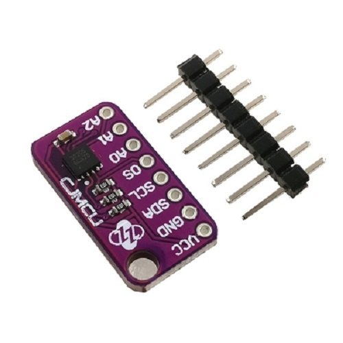
    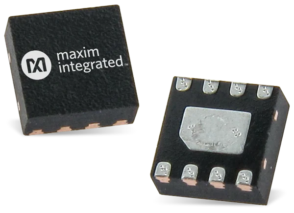

## Module Dimensions & Form Factor

### Component Size Specifications

| Component | Dimensions (L×W×H) | Volume | Integration Notes |
|-----------|-------------------|---------|-------------------|
| **ESP32-C6 Module** | 18 × 25.5 × 2.8 mm | 1,285 mm³ | Primary processing unit |
| **MAX30102 (Pulse Ox)** | 5.6 × 3.3 × 1.55 mm | 29 mm³ | Optical sensor placement critical |
| **MLX90632 (Temperature)** | 3.0 × 3.0 × 0.9 mm | 8 mm³ | Ultra-compact, minimal space requirement |
| **BMI270 (IMU)** | 2.5 × 3.0 × 0.83 mm | 6 mm³ | Motion sensing, any orientation |
| **200mAh Li-Po Battery** | 30 × 20 × 6 mm | 3,600 mm³ | Largest component, determines overall size |

### Device Configuration Options

The wearable platform supports multiple form factors to accommodate different use cases and user preferences:

| Configuration | Main Body Dimensions | Band Dimensions | Total Weight | Target Application |
|---------------|---------------------|-----------------|--------------|-------------------|
| **Minimal Clip-On** | 30×15×8 mm | None | 8-12g | Discrete monitoring, clinical trials |
| **Standard Wearable** | 40×20×10 mm | None | 15-20g | General health monitoring |
| **Arm Band - Compact** | 40×20×10 mm | 200×25×2 mm | 25-30g | Continuous daily wear |
| **Arm Band - Extended** | 50×25×12 mm | 250×30×2 mm | 35-40g | Extended battery, additional sensors |
| **Medical Grade** | 45×30×15 mm | 220×35×3 mm | 40-50g | Clinical deployment, enhanced durability |

### Design Considerations

**Ergonomic Factors:**
- **Skin Contact Area:** Optimized sensor placement for consistent measurements
- **Comfort Rating:** Lightweight materials and rounded edges for extended wear
- **Adjustability:** Multiple band sizes to fit 15-25cm circumference ranges
- **Water Resistance:** IP67 rating for daily activities and cleaning

**Manufacturing Specifications:**
- **PCB Dimensions:** 35×18×1.6mm (4-layer design for optimal routing)
- **Enclosure Material:** Medical-grade silicone or biocompatible TPU
- **Assembly Complexity:** Designed for automated pick-and-place manufacturing
- **Cost Target:** <$50 BOM cost at 1000-unit quantities

    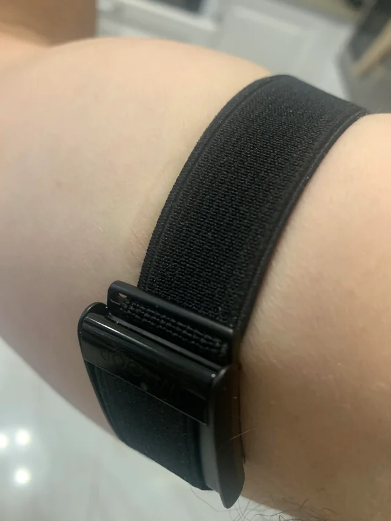
    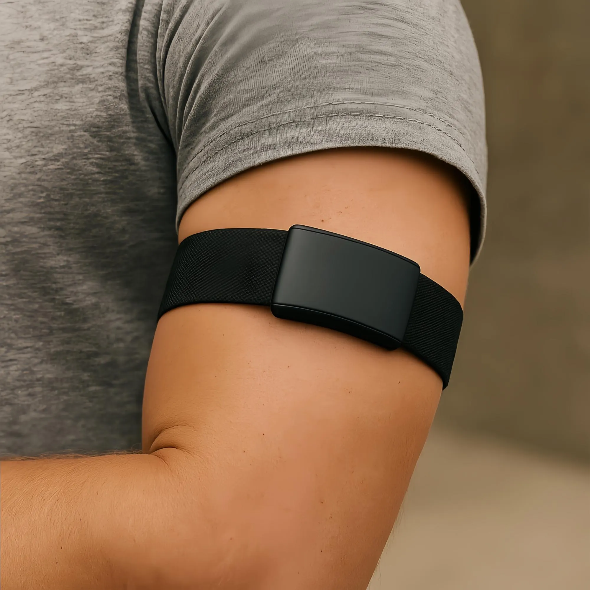

## Data Collection & Processing

### Sampling Strategy & Signal Processing
The device employs intelligent, adaptive sampling to capture critical health changes while optimizing power consumption and data quality.

**Core Approach:**
- Continuous or adaptive sampling of HR, SpO₂, and temperature with motion-informed filtering
- HRV derived from cleaned inter-beat intervals (time-domain: RMSSD, SDNN; frequency-domain optional in host/cloud)
- Activity classification initially basic (rest/active) using accelerometer magnitude variance

### Sampling Rates & Processing Windows

| Signal Type | Raw Sample Rate | Processing Window | Output Interval | Purpose |
|-------------|-----------------|-------------------|-----------------|---------|
| PPG (IR/Red) | 50–100 Hz | 5–8 s sliding | 5 s HR/SpO₂ | Heart rate & blood oxygen |
| Skin Temperature | 0.2–1 Hz | 60 s median | 60 s | Body temperature monitoring |
| Motion/Accelerometer | 25–50 Hz | 4 s | 4–10 s activity | Activity detection & artifact filtering |
| Battery Monitor | 0.016 Hz (1/min) | N/A | 60 s | Power management |

### Adaptive Power Management
**Energy Optimization:**
- Adaptive downscaling when vitals are stable (e.g., night mode) to save energy
- Motion-aware sampling adjustment based on activity level
- Intelligent duty cycling to extend battery life

### Signal Quality & Artifact Filtering
**Noise Reduction Techniques:**
- Band-pass filtering (0.5–5 Hz) for PPG signals
- Motion-correlated segment rejection for heart rate accuracy
- Interpolation of short signal gaps to maintain continuity
- Real-time data quality scoring and flagging

This smart sampling ensures the device captures important health changes without overwhelming users with excessive data or draining the battery unnecessarily.

## Optional Features

### Display Integration
For future versions requiring visual output, a small round display can be integrated. The Seeed Studio Round Display for XIAO is a compatible option:

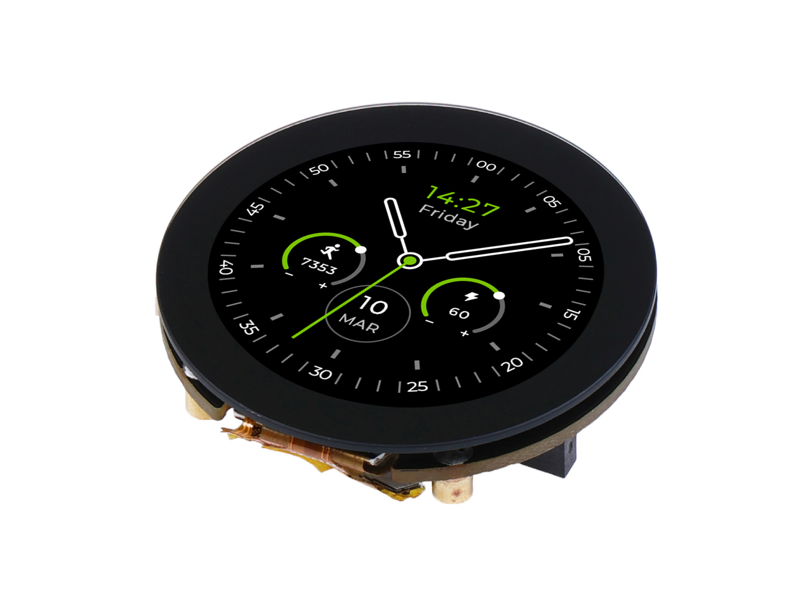
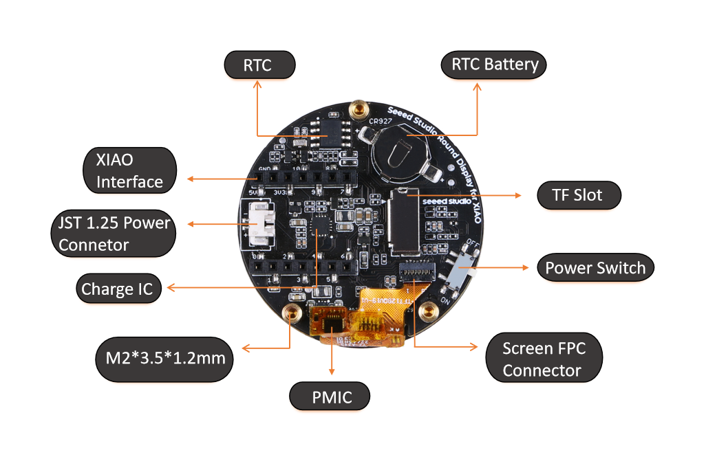

- **Specifications**: 1.28-inch round capacitive touch screen, 240×240 resolution, 65K colors, 39mm diameter.
- **Features**: Onboard RTC, battery charging, TF card slot, suitable for wearable projects.
- **Compatibility**: Works with ESP32-C6 and other XIAO modules for plug-and-play setup.
- **Setup Guide**: Refer to the [Seeed Studio getting started guide](https://wiki.seeedstudio.com/get_start_round_display/) for hardware preparation, software installation, and example demos.

This optional display enhances user interaction while maintaining the device's focus on sensor-based monitoring.

## System Architecture

High-level data flow:

```
[Sensors: PPG | Temp | IMU] --I2C/SPI--> [MCU Acquisition Layer]
  -> Ring Buffers -> [Signal Conditioning & Feature Extraction]
  -> Metric Cache -> [Edge Alerts Engine]
  -> BLE (GATT) <-> Phone App (real-time)
  -> Wi-Fi Batch Uploader -> [Secure API Gateway]
              |
           [Message Queue]
              |
            [Processing / Normalization]
              |
             [FHIR Mapper + Storage]
              |
           [Analytics / Dashboard / EHR]
```

Edge Alerts Engine (examples):
- Low SpO₂ sustained (< 92% for > 30 s)
- Tachycardia / Bradycardia thresholds age-configurable
- Rapid temp rise (>0.8°C over 15 min)
- High motion artifact suppression (flag data quality)

## Power & Energy Budget

### Battery Specifications & Runtime Analysis
**Target Configuration:** 3.7V Li-Po, 150–200 mAh capacity

### Current Consumption Breakdown

| Component | Active Current | Duty Cycle | Average Current | Notes |
|-----------|----------------|------------|-----------------|-------|
| **Core Processing** |
| MCU (ESP32-C6, light sleep) | 3.0 mA | 70% | **2.1 mA** | Baseline processing |
| **Wireless Communication** |
| Wi-Fi (burst sync) | 120 mA | 1% | **1.2 mA** | Short data transfers |
| BLE (advertising/connection) | 8 mA | 20% | **1.6 mA** | Tuned intervals |
| **Sensors** |
| PPG LEDs + Analog Front-End | 6–12 mA | 50% adaptive | **4.5 mA** | Heart rate/SpO₂ |
| Temperature Sensor | 1 mA | 5% | **0.05 mA** | Periodic readings |
| IMU (Motion Sensor) | 0.8 mA | 30% | **0.24 mA** | Reduced ODR |
| **Power Management** |
| Voltage Regulation Loss | — | — | **0.4 mA** | Efficiency overhead |
| **Total System** | | | **~10.1 mA** | Continuous operation |

### Runtime Calculations & Optimization

**Current Performance:**
- **Estimated Runtime:** 150 mAh ÷ 10.1 mA ≈ **14–15 hours** (continuous operation)
- **With 200 mAh battery:** ~19–20 hours

**Optimization Strategies:**
- **Night/Rest Mode:** Reduce PPG sampling and LED current → **30–40% power savings**
- **Adaptive Batching:** Wi-Fi sync every 10–30 minutes based on urgency
- **Motion-Aware Sampling:** Reduce heart rate sampling when stationary
- **Dynamic Duty Cycling:** Intelligent sensor scheduling based on activity

**Performance Target:** **24+ hours** operation with 200 mAh battery after optimizations.

## System Integration & Connectivity Patterns

### Hardware Integration Architecture

**Sensor Interface Layer:**
- **I2C Bus**: Primary communication for pulse oximeter (MAX30102), temperature sensor (MLX90632)
- **SPI Interface**: High-speed data transfer for motion sensor (BMI270) and optional display
- **Analog GPIO**: Battery monitoring and auxiliary sensor inputs
- **UART/Serial**: Debug interface and optional external module communication

**Component Interconnection:**
```
ESP32-C6 Microcontroller
├── I2C Bus (400kHz)
│   ├── MAX30102 (Pulse Oximeter) @ 0x57
│   ├── MLX90632 (Temperature) @ 0x3A
│   └── MAX17048 (Battery Monitor) @ 0x36
├── SPI Bus (8MHz)
│   ├── BMI270 (IMU) - CS: GPIO2
│   └── Round Display (Optional) - CS: GPIO3
└── GPIO
    ├── LED Status Indicators
    ├── Power Control Switches
    └── Hardware Reset Lines
```

### Wireless Communication Patterns

**Bluetooth Low Energy (BLE) Stack:**
- **GATT Profile**: Custom health monitoring service
- **Real-time streaming**: Live vital signs to mobile apps
- **Connection intervals**: 20-100ms for responsive data transfer
- **Security**: Bonding with numeric comparison for secure pairing

**Wi-Fi Integration Modes:**
- **Direct Cloud Upload**: Periodic batch synchronization (every 10-30 minutes)
- **Local Network Hub**: Connection to home routers for family monitoring
- **Enterprise Integration**: WPA2/WPA3 enterprise for hospital networks
- **Mesh Networking**: Device-to-device relay for extended coverage

### Data Flow Integration Patterns

**Edge-to-Cloud Pipeline:**
1. **Local Processing**: Real-time filtering and basic anomaly detection
2. **Buffering Strategy**: Ring buffers with overflow protection
3. **Compression**: JSON-LD compression for efficient transmission
4. **Retry Logic**: Exponential backoff with offline storage capability
5. **Quality Assurance**: Data integrity checks and duplicate prevention

**Healthcare System Integration:**
- **HL7 FHIR Compliance**: Automated mapping to Observation resources
- **EHR Integration**: Direct API connections to Epic, Cerner, Allscripts
- **RPM Platforms**: Integration with remote patient monitoring services
- **Telehealth Solutions**: Real-time data sharing during virtual consultations

### Platform Integration Examples

**Hospital Information Systems:**
```yaml
Integration Type: HL7 FHIR R4
Endpoint: POST /fhir/Observation
Authentication: OAuth 2.0 + mTLS
Data Mapping: Custom vital signs profile
Frequency: Real-time alerts + 15-min batches
```

**Research Platforms:**
```yaml
Integration Type: REDCap API
Endpoint: POST /api/data
Format: Custom instrument forms
Security: API tokens + field-level encryption
Compliance: 21 CFR Part 11 audit trails
```

**Consumer Health Apps:**
```yaml
Integration Type: Apple HealthKit / Google Fit
Protocol: OAuth 2.0 + SMART on FHIR
Data Types: Heart rate, SpO2, temperature
Sync: Background automatic + manual trigger
```

This comprehensive integration approach ensures seamless connectivity across diverse healthcare ecosystems while maintaining security and regulatory compliance.

## Software Development Kit (SDK)

The project includes an SDK for easy integration with other systems:

* **APIs**: REST + WebSocket streaming for real-time metrics, pagination for historical queries.
* **Data Formats**: JSON, optional HL7 FHIR resources (Observation, Device, Patient) via mapper.
* **Security**: OAuth2 (client credentials / device code), JWT access tokens, TLS 1.2+.
* **Edge → Cloud Sync Modes**: Real-time BLE relay; deferred Wi-Fi batch (compressed JSON lines); push via MQTT (optional future).
* **Client Libraries**: Planned: JavaScript/TypeScript, Python, Go. Provide typed models + retry/backoff.
* **Alert Customization**: Threshold + trend-based rules definable via /alerts endpoints.
* **Data Quality Flags**: Motion artifact %, IR signal quality index, perfusion index.

## API Reference (Draft)

Base URL (example): `https://api.examplehealth.dev/v1`

Authentication: `Authorization: Bearer <token>`

| Method | Path | Purpose |
|--------|------|---------|
| POST | /auth/device/register | Provision a device (returns credentials) |
| POST | /auth/token | OAuth2 token exchange |
| GET | /devices/{id} | Device metadata |
| GET | /devices/{id}/metrics/latest | Latest composite vitals |
| GET | /devices/{id}/metrics/stream (WS) | Live streaming (JSON frames) |
| GET | /devices/{id}/metrics?from=..&to=.. | Historical time-series |
| GET | /devices/{id}/alerts | Active + past alerts |
| POST | /alerts/rules | Create alert rule |
| GET | /fhir/Observation?device=... | FHIR Observations (server mapped) |

Example: Latest Metrics Response
```json
{
  "deviceId": "dev_12345",
  "timestamp": "2025-09-12T08:15:27Z",
  "hr": 72,
  "spo2": 97,
  "hrv": { "rmssd": 41 },
  "skinTempC": 33.4,
  "activity": "rest",
  "batteryPct": 84,
  "quality": { "ppgMotionFlag": false, "perfusionIndex": 5.2 }
}
```

WebSocket Frame (example):
```json
{"t":"2025-09-12T08:15:28.500Z","hr":72,"spo2":97,"motion":0.02}
```

## Data Schema Examples

### Internal Edge Packet (compressed JSON lines pre-upload)
```json
{
  "t": "2025-09-12T08:15:20Z",
  "hr": 72,
  "spo2": 97,
  "st": 33.4,
  "b": 3.98,
  "act": 0,
  "q": { "af": 0.01, "pi": 5.2 }
}
```

### FHIR Observation (HR example)
```json
{
  "resourceType": "Observation",
  "status": "final",
  "category": [{"coding":[{"system":"http://terminology.hl7.org/CodeSystem/observation-category","code":"vital-signs"}]}],
  "code": {"coding":[{"system":"http://loinc.org","code":"8867-4","display":"Heart rate"}]},
  "subject": {"reference": "Patient/pat_001"},
  "device": {"reference": "Device/dev_12345"},
  "effectiveDateTime": "2025-09-12T08:15:27Z",
  "valueQuantity": {"value": 72, "unit": "beats/min", "system": "http://unitsofmeasure.org", "code": "/min"}
}
```

## Security & Compliance

| Aspect | Approach |
|--------|---------|
| Transport | TLS 1.2+ enforced; certificate pinning optional in mobile SDK |
| Data at Rest | Encrypted storage (AES-256) for cached packets on device & server DB encryption |
| AuthN/Z | OAuth2 + scoped JWT; per-device key rotation |
| PII Separation | Device telemetry decoupled from patient identity (link table w/ access controls) |
| Audit | Immutable append-only audit log for data access & alert modifications |
| Regulatory Considerations | HIPAA (US), GDPR (EU) principles (minimization, consent, deletion workflow) |
| Secure Boot / Firmware | Signed firmware images (future) + version attestation |

Threat Surface Mitigations:
- Replay prevention: nonce + timestamp in batch envelope
- BLE pairing with passkey or numeric comparison
- Rate limiting / anomaly detection for API keys

## Testing & Validation

| Layer | Method |
|-------|--------|
| Sensor Signal | Controlled bench tests with optical tissue simulators / temp plates |
| Algorithm | Synthetic waveform injection + golden HR/SpO₂ traces |
| Firmware | Unit tests (filter windows, HRV calc), power profiling scripts |
| Cloud API | Contract tests (OpenAPI), load tests for streaming sessions |
| Data Quality | Compare against clinical-grade reference (pulse oximeter, thermometer) |

Calibration Strategy:
- Initial LED current sweep per user during pairing
- Temperature offset calibration vs ambient + skin contact settling (first 3–5 min)
- Motion artifact model refinement with labeled activity sessions

Quality Metrics: Missing sample %, artifact rejection rate, drift vs reference, uptime.

## Development Roadmap

Once the prototype is complete, the next steps include:
- Designing and fabricating a custom PCB with integrated SMD modules for improved efficiency and reduced costs.
- Expanding the SDK with more features for broader healthcare integrations.
- Testing in real-world clinical settings for validation and refinements.
- Exploring partnerships for commercial production and distribution.

Contributions and feedback are welcome to advance this project.

## Summary

An extensible wearable health telemetry platform emphasizing low-cost sensing, secure data pathways, and interoperable health data (FHIR-ready). Designed for integration with digital health ecosystems like MyDR24 to provide real-time medical insights. This README now outlines hardware component options, architecture, energy model, preliminary API, data schemas, and compliance posture to accelerate prototype-to-product evolution.

---

Status: Early prototype phase. Contributions and feedback encouraged.
