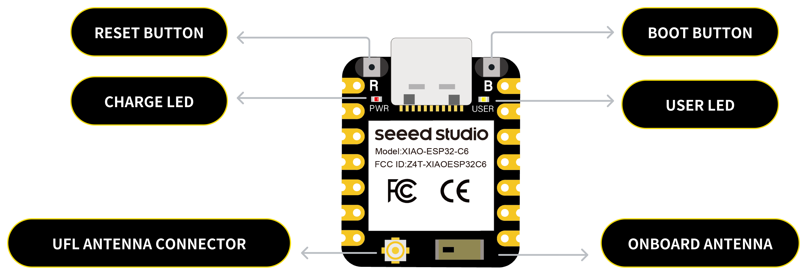

# Wearable – Healthcare IoT+SDK Concept


> A modular, network-aware wearable platform (band form-factor) for continuous vital-sign monitoring, early warning scoring, and tele-consultation. Designed for chronic care follow-up, hospital-at-home, and wellness use cases.

---

**Hardware Baseline:**

* **MCU:** XIAO ESP32-C6 SoC (RISC-V 160MHz, Wi-Fi 6/BLE 5.3, Ultra-low power)
  * 320KB SRAM, 4MB Flash
  * Power: Deep sleep @ 7μA, Active BLE @ 15mA
  * Hardware crypto accelerator for medical-grade security

    
    

* **Sensors:**

  * MAX30102 – Oximeter & Heart Rate (SpO₂ + HR)

    
    


  * MAX30205 – Human Skin Temperature
  
    
    

---

## 1. Core Sensing

**Photoplethysmography:**
* Raw IR/R capture with moving average smoothing
* HRV calculation (RMSSD) with baseline drift compensation
* Arrhythmia classification capabilities

**SpO₂ Monitoring:**
* Ratio-of-ratios calculation with lookup tables
* Adaptive calibration with ML-based correction
* Cohort-based normalization

**Temperature Sensing:**
* 1 Hz sampling with skin vs ambient compensation
* Multi-sensor fusion for accuracy
* Outlier suppression using median-of-last-N

**Motion Tracking:**
* IMU integration for activity recognition
* Energy expenditure calculation
* Movement artifact compensation

**Core Algorithms:**
* Rolling window (8–16 samples) smoothing
* Peak interval estimation for heart rate
* SpO₂ estimation with perfusion index
* Adaptive dynamic sampling based on variance

---

## 2. Networking Architecture

**Communication Stack:**
* BLE peripheral with `esp32-nimble` for advertising and GATT characteristics
* BLE Mesh support via `btmesh-rs` for multi-device environments
* Wi-Fi 6 direct upload capabilities for high-bandwidth scenarios
* Zenoh edge fabric for distributed computing

**Data Protocol:**
* `postcard` serialized structs (≤ 64 bytes per frame)
* COBS encoding for UART debugging
* lz4_flex compression for burst events
* Frame signing with Ed25519

**Bridge Implementation:**
* Rust daemon using `btleplug` for BLE connectivity
* MQTT publishing via `rumqttc` with topic structure: `wearable/{device_id}/vitals`
* HTTP fallback with `/ingest` endpoint
* Exponential backoff retry (max 60s) with local ring buffer persistence

---

## 3. Firmware Architecture

**Runtime Environment:**
* `embassy` async runtime with `embassy-executor`
* I²C communication (async/blocking hybrid)
* GPIO control for LED indicators
* Timer-based sampling cadence

**Driver Stack:**
* Modular sensor drivers (`max30102`, `max30205` crates)
* `heapless::spsc::Queue` for RAM buffering
* Circular flash log with fixed-size blocks
* `smoltcp` for network streaming

**Power Management:**
* Duty-cycled LED operation
* Adaptive sampling rates based on signal variance (<2% threshold)
* Deep sleep modes between sampling windows
* Target: <2.5 mA average current (1Hz temp, 25Hz PPG bursts)

**Reliability:**
* Watchdog timer with 5s sensor stall detection
* Brownout recovery mechanisms
* Error recovery with lightweight enum handling
* `defmt` logging for debugging

---

## 4. Bridge Layer

**Core Functionality:**
* BLE scanning, connection, and GATT subscription management
* Frame validation with Ed25519 signatures
* Local caching with SurrealDB or JSON fallback
* MQTT/HTTP upstream publishing

**Advanced Features:**
* Rhai rules engine for complex event processing
* gRPC support via `tonic`
* Multi-device session management
* Tauri-based GUI for user interaction

**Alert System:**
* Inline threshold evaluation (SpO₂ < 90, Temp > 38°C)
* Configurable alert rules
* Webhook notifications

---

## 5. Cloud Infrastructure

**API Layer:**
* `axum` REST API with endpoints:
  * `POST /ingest` - bulk frame ingestion
  * `GET /vitals/latest` - current readings
  * `GET /vitals/{device}` - device history
* WebSocket streaming for real-time data
* GraphQL API via `async-graphql`

**Storage:**
* SurrealDB with timeseries schema
* Delta Lake for analytics workloads
* DataFusion for SQL analytics
* Schema: `vitals { device_id, ts, hr, spo2, temp, flags }`

**Frontend:**
* Leptos reactive dashboard
* Real-time vitals display
* Historical charts (15-min, 1-hour, 24-hour views)
* HTMX for progressive enhancement

**Background Services:**
* Alert scanning (last N minutes window)
* Data aggregation pipelines
* Export services for training datasets

---

## 6. AI/ML Analytics

**Signal Processing:**
* Exponential moving average baseline tracking
* Z-score anomaly detection
* Quality flagging for artifacts (flatline/saturation)
* HRV metrics (RMSSD, pNN50)

**Machine Learning:**
* Candle/burn runtime for on-device inference
* Arrhythmia classification models
* Sleep staging algorithms
* Personalized baseline adaptation

**Cohort Analytics:**
* Multi-device pattern recognition
* Population health insights
* Predictive alerting based on trends

---

## 7. Security & Privacy

**Cryptographic Stack:**
* AES-256-GCM for session encryption
* Ed25519 for signatures (firmware & frames)
* Argon2 for key derivation
* SHA-256/BLAKE3 for integrity
* `zeroize` for secure memory clearing

**Post-Quantum Readiness:**
* X25519 + Kyber768 hybrid for TLS
* Dilithium3 dual-signing for firmware
* SPHINCS+ for immutable audit logs

**Transport Security:**
* BLE pairing with passkey authentication
* TLS via `rustls` for all network communication
* Noise protocol for enhanced pairing security

**Compliance Features:**
* Differential privacy mechanisms
* Audit logging (append-only)
* FHIR façade for interoperability
* Encrypted storage at rest

---

## 8. Safety & Reliability

**Firmware Safety:**
* Version rollback protection
* Signed firmware bundles
* OTA update validation
* Calibration persistence

**Formal Methods:**
* Property testing with `proptest`
* Formal verification with kani/prusti
* NEWS2 scoring implementation
* Redundancy voting logic

**Quality Assurance:**
* Unit tests for sensor parsers
* Integration tests with loopback simulation
* Hardware-in-the-loop testing
* Performance benchmarking

---

## 9. Deployment Scenarios

* **Hospital-at-home:** Continuous streaming to bedside hub
* **Care homes:** Multi-band mesh networking to ceiling bridges
* **Wellness/Sports:** Direct sync to coach tablets, offline-capable
* **Remote monitoring:** Cloud-based dashboards with alert escalation
* **Clinical trials:** Research-grade data collection with audit trails

---

## 10. Developer Resources

**Repository Structure:**
```
workspace/
  firmware/      # ESP32-C6 firmware and drivers
  bridge/        # BLE-to-cloud relay daemon
  cloud/         # Backend API and dashboard
  shared/        # Common types and protocols
  sdk/           # Developer SDK and examples
  docs/          # API documentation and guides
```

**Development Tools:**
* `probe-rs` for flashing and debugging
* `espup` for toolchain management
* `defmt-print` for structured logging
* Cross-compilation support

**CI/CD Pipeline:**
* Build verification
* Clippy linting
* Format checking
* Unit/integration tests
* Hardware matrix testing
* Fuzz testing
* Performance benchmarks

---

## 11. Performance Specifications

* **Power Consumption:** <2.5 mA average (configurable sampling)
* **HR Calculation Latency:** <250 ms from sample arrival
* **BLE Packet Loss:** <1% with 5s retry window
* **Buffer Capacity:** ≥30 minutes offline tolerance
* **Firmware Size:** <180 KB initial image
* **Sampling Rates:** 1-100 Hz configurable
* **Data Throughput:** 10-500 Hz aggregate sensor data

---

## 12. Technical Roadmap

**Infrastructure Evolution:**
* Multi-tenant organization boundaries
* High-availability ingest clusters
* Edge federation with zenoh
* Rolling firmware updates
* Fleet orchestration

**Feature Expansion:**
* Additional sensor modalities (ECG, EEG)
* Environmental monitoring
* Medication adherence tracking
* Fall detection
* Voice biomarkers

**Platform Integration:**
* FHIR/HL7 healthcare standards
* Apple HealthKit/Google Fit
* Electronic Health Records (EHR)
* Telemedicine platforms
* Research data repositories

---

**Outcome:**
A comprehensive **band-style wearable + SDK** framework for healthcare and wellness—supporting COPD monitoring, post-op recovery, chronic care, and fitness analytics—built entirely in **Rust** with production-ready connectivity, security, and cloud
